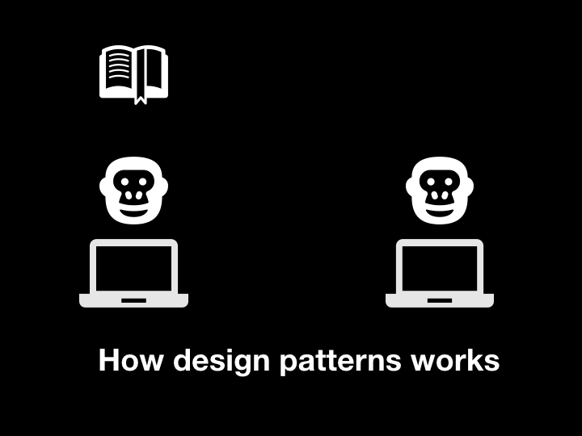
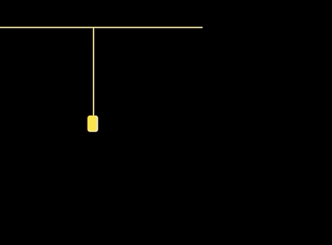

# headFirst-designPatterns



### ❓ 什么是设计模式

- 定义：代码设计中常见的问题的解决方案的总结
- 来源：这个术语是由埃里希·伽玛（Erich Gamma）等人在1990年代从建筑设计领域引入到计算机科学的，用于对常见建筑设计的归纳。

可是在学习的过程中，我发现其实设计模式并没有解决什么问题，书中提出的问题，即使不学习，也能写出另一种答案。与书中方案进行对比之后，发现了：

- 我的代码并不如书中的优雅和容易扩展
- 我不能准确整理出我的代码的特性、规律和维护方案

综上，设计模式应该是一种更容易扩展的代码模型，更优雅的实现方式，比起「解决问题」更像是一种「优化方案」。

``` 
基于约束进行设计，根据审美进行创造。
```


### 💡 设计模式分类

与书中的分类方式「**创建型-结构型-行为型**」不一样，为了方便提取和记忆，我按照自己的理解，分成四类：



- **功能**：对对象功能进行加工、扩展，包含「命令、策略、装饰者」模式
- **访问**：对访问途径进行加工、扩展，包含「工厂、组合、迭代器、适配器、代理、单例」模式
- **过程**：对过程进行加工、控制、扩展，包含「模版、状态、中介者」模式
- **消息**：增加广播提示的函数库，包括「观察者、发布-订阅」模式

这个分类的方式，是我根据电灯的「灯泡（功能）-安装（过程）-访问（接口）-消息（通电）」这个最简约的工业产品的基本设计思路，来进行分类的。有以下好处：

1. 符合事物的特性。本身 JS 就是面向对象设计的。
2. 方便记忆。想不起来时候抬头看一下就行了。

如果你有更好的分类方法，欢迎交流😊。


### 💬 设计模式的定义

注意不要偏离设计模式的定义。如果只用自己的话去理解，一是容易写出偏离实际设计模式的代码，二是交流时候显得不专业。

- 功能：要对对象的功能进行扩展，无非添加、选择、增强三种方法，对应命令、策略、装饰者模式。
  - 装饰模式是一种结构型设计模式， 允许你通过将对象放入包含行为的特殊封装对象中来为原对象**绑定新的行为**。
  - 策略模式是一种行为设计模式， 它能让你定义一系列算法， 并将每种算法分别放入独立的类中， 以使算法的对象能够**相互替换**。
  - 命令模式是一种行为设计模式， 它可将请求转换为一个包含与请求相关的所有信息的独立对象。 该转换让你能根据不同的请求将方法参数化、 延迟请求执行或将其**放入队列**中， 且能实现**可撤销**操作。


### 🌟 设计模式的功能

上面说了，设计模式就是各种大牛程序员给你总结的优化设计思路。其功能有 3：

- **方便学习**。这些软件通用的开发经验赋予「XX 模式」这样的名词之后，有利于学习、记忆和实践。比如 Promise 可以构成状态模式，Vue 的响应式设计通过发布-订阅模式完成。
- **方便交流**。你跟其他程序员说“用 XX 模式实现更好”的时候，他就能马上领会。相当于数学里面的公式，给外行人解释需要各种解题步骤，给内行人就直接一个公式就行了，简洁而精准。
- **方便维护**。设计模式目的就是让代码具有良好的扩展性和可维护性。而且，如果代码都符合设计模式的话，就可以把这类代码总结成这个模式的例子，对于分类归纳极有好处。


### 🎙️ 面试中常见问题

- 顺丰：装饰者模式是什么？应用于什么场景？
- 土巴兔：观察者模式和发布-订阅模式有什么差别？策略模式和适配器模式呢？

